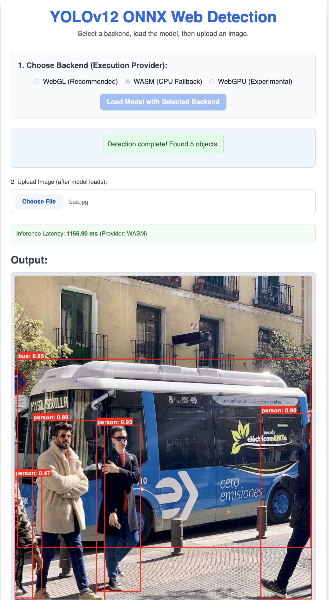

# YOLOv12 ONNX Deployment and Optimization Project

This project focuses on the training, cross-platform deployment, and performance optimization of a YOLOv12 object detection model. It details the process from PyTorch model training to ONNX conversion, followed by benchmarking on desktop and web platforms.

## Project Objectives

The primary goals of this project are to:

* Train a YOLOv12 object detection model using PyTorch.
* Convert the trained PyTorch model to the ONNX (Open Neural Network Exchange) format.
* Deploy and evaluate the ONNX model on desktop environments (CPU and GPU).
* Conceptually explore web browser deployment using ONNX Runtime for Web.
* Implement and evaluate model optimization techniques within the ONNX ecosystem, such as different precision exports (FP32, FP16, attempted INT8) and graph optimization.
* Quantify and compare performance metrics including inference latency, throughput, model size, and system resource utilization (CPU/GPU memory, GPU utilization).
* Benchmark native PyTorch performance against various ONNX configurations, using PyTorch CPU as a baseline.
* Calculate mAP50 on the training dataset for PyTorch models to assess training fit.
* Demonstrate the ease of ONNX model visualization using tools like Netron.

## Directory Structure

```
Deploy_Optimize_CV_Model/
├── data/
│   ├── train/
│   │   ├── images/
│   │   └── labels/
│   └── data.yaml
│
├── src/
│   ├── utils.py
│   ├── train_yolo.py
│   ├── export_to_onnx.py
│   ├── optimize_onnx.py
│   ├── inference_desktop.py
│   ├── test_onnx_model.py
│   ├── benchmark_suite.py
│   └── web_deployment/
│       ├── index.html
│       ├── style.css
│       ├── app.js
│       └── model.onnx
│
├── trained_models/
│   ├── pytorch/
│   └── onnx/
│
├── logs/
│   ├── main_project_{timestamp}.log
│   ├── training.log
│   ├── export.log
│   ├── optimization.log
│   ├── inference_desktop.log
│   ├── test_onnx_model.log
│   └── benchmarking.log
│
├── requirements.txt
└── README.md
```

## Setup and Installation

1.  **Clone Repository:**
    Clone or download the project files to your local machine.

2.  **Create Python Virtual Environment:**
    Navigate to the project root directory (`Deploy_Optimize_CV_Model/`) and create a virtual environment:
    ```bash
    python -m venv venv
    ```
    Activate the environment:
    * macOS/Linux: `source venv/bin/activate`
    * Windows: `venv\Scripts\activate`

3.  **Install Dependencies:**
    Install the required Python packages:
    ```bash
    pip install -r requirements.txt
    ```
    * **Note:** The `requirements.txt` includes `ultralytics`. If your YOLOv12 implementation is from a different source, you may need to adjust installation steps. For NVIDIA GPU statistics in benchmarks, install `pynvml`: `pip install pynvml`.

4.  **Prepare Dataset (Mini COCO):**
    * Obtain the COCO dataset (e.g., 2017 train/val images and annotations).
    * Create a "mini" subset of images and labels for manageable training.
    * Organize into `data/train/images/`, `data/train/labels/`, `data/valid/images/`, `data/valid/labels/`.
    * Labels must be in YOLO TXT format: `<class_id> <center_x_norm> <center_y_norm> <width_norm> <height_norm>`.
    * Configure `data/data.yaml` with dataset paths and class names.
    * Place sample images in `data/test_images/`.
    * **For Ultralytics INT8 PTQ:** Create `data/calibration_data.yaml` pointing to a small representative image subset (100-500 images) for calibration. Update `CALIBRATION_DATA_YAML` in `src/export_to_onnx.py` if needed.

5.  **Pretrained Weights (Optional):**
    For fine-tuning, download YOLOv12 pre-trained weights (`.pt` file) and ensure `MODEL_VARIANT` in `src/train_yolo.py` points to them.

## Running Scripts

Execute scripts from the project root directory with the virtual environment activated.

1.  **Train Model:**
    ```bash
    python src/train_yolo.py
    ```
    The best model (`best.pt`) will be saved in `trained_models/pytorch/`. Check `logs/training.log`.

2.  **Export to ONNX (FP32, FP16, Attempt INT8):**
    Update `PYTORCH_MODEL_PATH` in `src/export_to_onnx.py` to your `best.pt` file. Ensure `CALIBRATION_DATA_YAML` is set for INT8 export attempts.
    ```bash
    python src/export_to_onnx.py
    ```
    This creates `yolov12_coco.onnx` (FP32), attempts `yolov12_coco_fp16.onnx` (FP16), and attempts `yolov12_coco_ultralytics_ptq.onnx` (INT8). Check `logs/export.log`.

3.  **Optimize ONNX Models:**
    ```bash
    python src/optimize_onnx.py
    ```
    This script applies graph optimizations to the exported ONNX models and provides a fallback ONNX Runtime dynamic quantization if Ultralytics INT8 export failed. Outputs include `yolov12_coco_optimized.onnx`, `yolov12_coco_fp16_optimized.onnx`, etc. Check `logs/optimization.log`.

4.  **Test Single ONNX Model (with Overlay):**
    ```bash
    python src/test_onnx_model.py --model_path ../trained_models/onnx/YOUR_MODEL.onnx --image_path ../data/test_images/YOUR_IMAGE.jpg --output_image_path ../data/test_images/output_YOUR_MODEL.jpg
    ```
    Replace placeholders accordingly. Check `logs/test_onnx_model.log`.

5.  **Run Automated Benchmarking:**
    Ensure model paths at the top of `src/benchmark_suite.py` are correct.
    ```bash
    python src/benchmark_suite.py
    ```
    Benchmarks PyTorch (CPU/GPU) and various ONNX configurations. Results (latency, throughput, size, memory, GPU util, PyTorch mAP50 on training data) are printed in a table and logged in `logs/benchmarking.log`. ONNX mAP50 is a placeholder ("N/A").

6.  **Web Deployment (Browser Demo):**
    * Copy a target ONNX model (e.g., `yolov12_coco_fp16.onnx`) to `src/web_deployment/` and rename it to `model.onnx` (or update `app.js`).
    * Serve the `src/web_deployment` directory:
        ```bash
        cd src/web_deployment
        python -m http.server 8000
        ```
    * Open `http://localhost:8000` in your browser. Select a backend, load the model, then upload an image.
    
    * Here is a screenshot of how the web version looks ==>

    

## ONNX Model Visualization

Use **Netron** (netron.app or desktop app) to visualize `.onnx` model architectures from `trained_models/onnx/`. This helps in understanding model structure and debugging.

## Logging

* Python's `logging` module is used.
* A main timestamped project log is in `logs/main_project_{timestamp}.log`.
* Each script generates specific logs in the `logs/` directory.
* Console output provides progress and key results.

## Important Notes and TODOs

* **YOLOv12 Implementation:** Scripts assume an Ultralytics-compatible API. Adapt if using a different YOLOv12 source.
* **Resources:** Deep learning training and benchmarking are resource-intensive. A CUDA-enabled GPU is recommended.
* **Dataset:** The quality and size of your "mini COCO" dataset will impact results.
* **Web Implementation (`app.js`):** Accurate implementation of preprocessing, postprocessing, and NMS in JavaScript is crucial for the web demo.
* **ONNX mAP:** Calculating mAP for ONNX models in `benchmark_suite.py` requires a custom evaluation pipeline (TODO).
* **Error Handling:** Basic error handling is present; consider enhancements for robustness.
